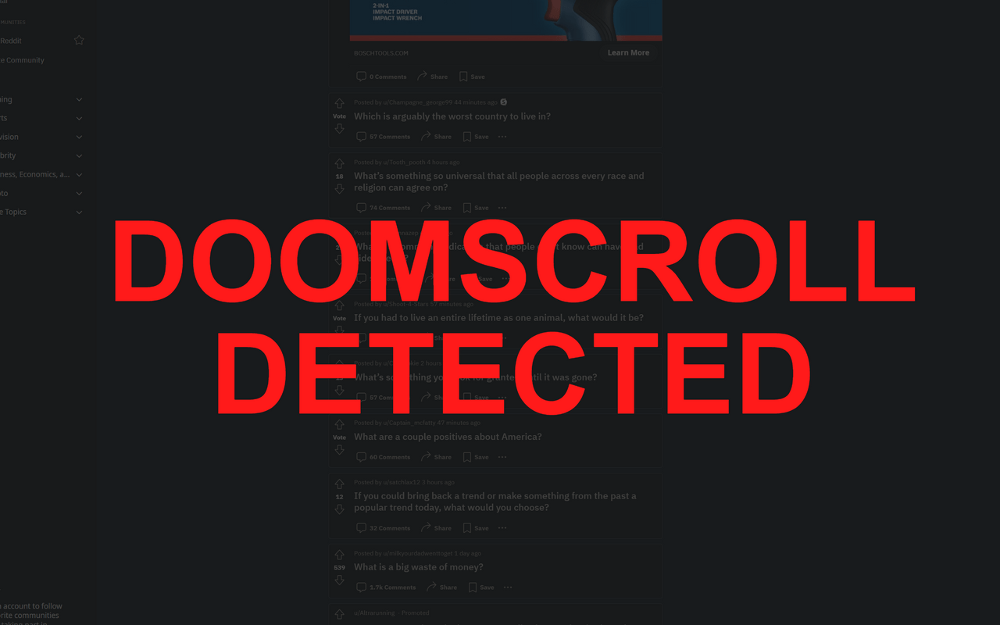
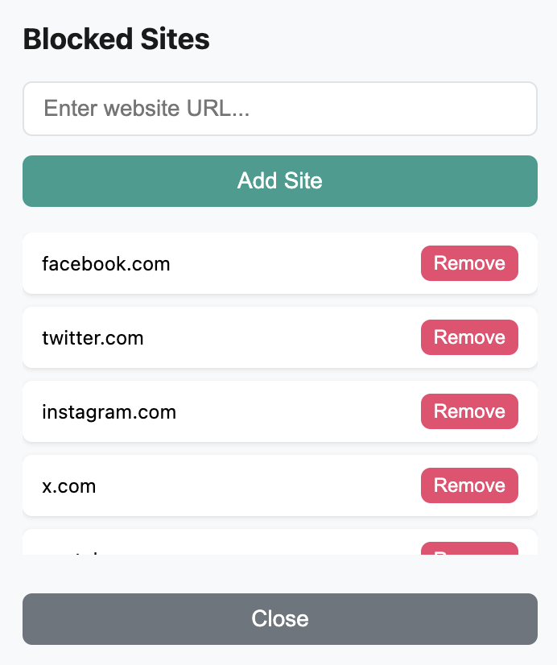

#  Doomscroll Blocker

> A chrome extension to block doom scrolling and help you touch grass!

## Features

- Doomscroll Detection and Blocking
- Customizable Blocked Sites
- Beautiful Colors and Animations
- Motivational Messages After Doomscroll

## Screenshots

  
  

## Changelog

### 0.3.3

- Allow specifying subdomains

### 0.3.2

- Name update
- Description update

### 0.3.1

- UI Improvements.

### 0.3.0

- Major bug fixes involving blocked sites not working on install.
- User Experience Improvements.
- Upgraded vulnerable dependencies.

### 0.2.1

- Minor bug fixes.

### 0.2.0

- Major UI/UX Improvements.

### 0.1.0

- Initial release!

## Install

[**Chrome** extension](https://chrome.google.com/webstore/detail/doomscroll-blocker/gneldbncofioemhoaifgeneiadeodgmh?hl=en&authuser=0)

## Contribution

Suggestions and pull requests are welcomed!.

https://github.com/Zjjc123/doomscroll-blocker

---

This project was bootstrapped with [Chrome Extension CLI](https://github.com/dutiyesh/chrome-extension-cli)
